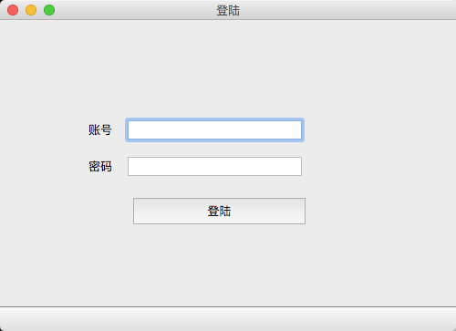
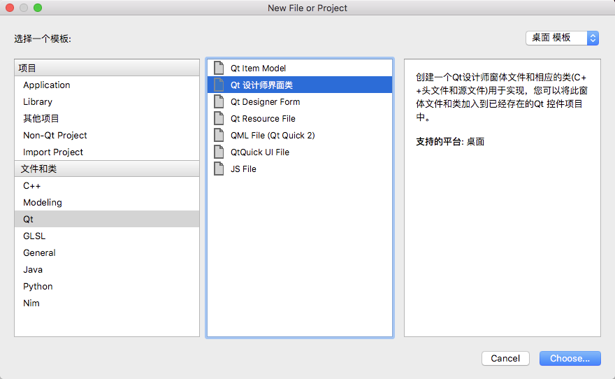
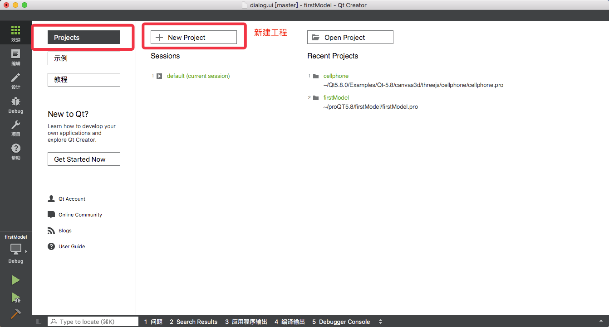
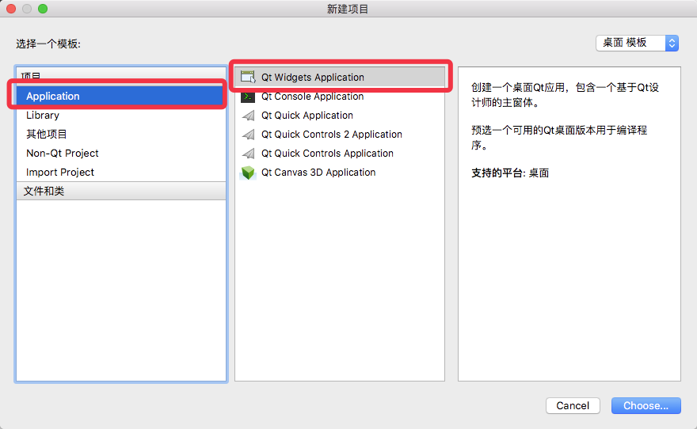
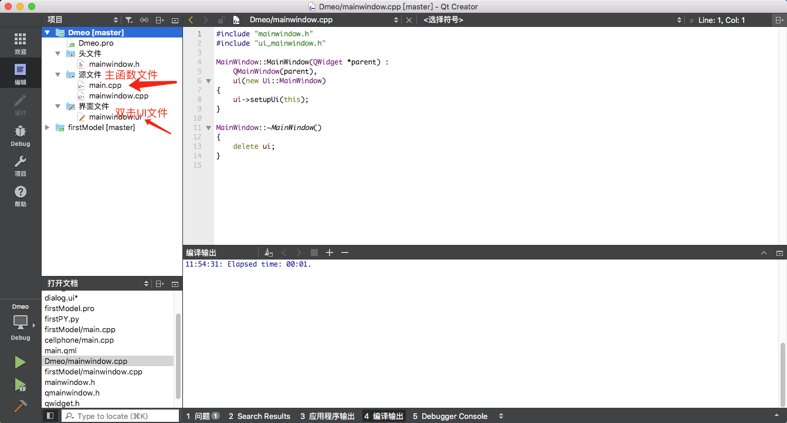
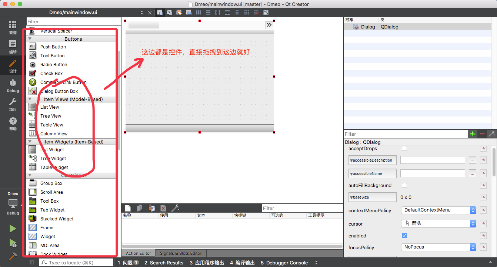
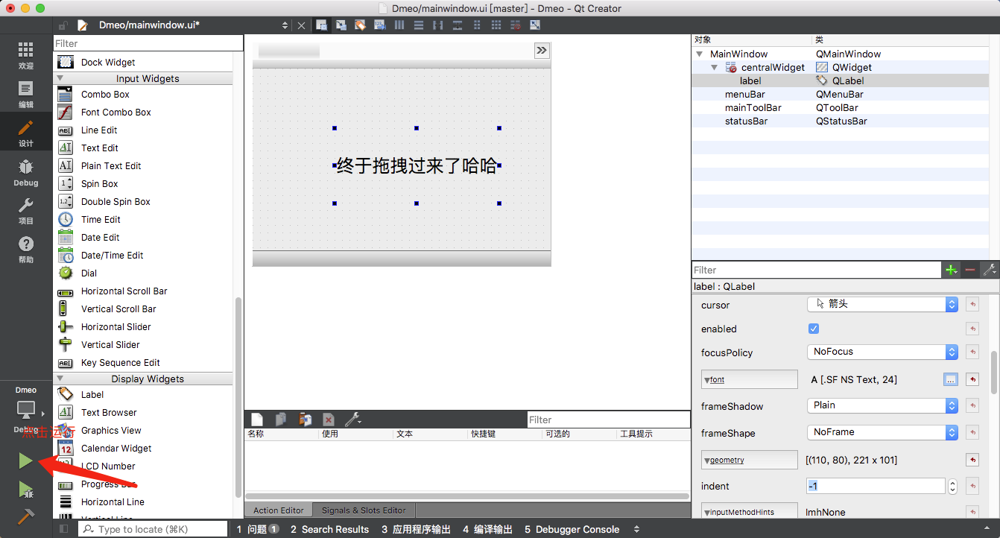

大家关注的教程2来了。
第一期是代码布局，现在有更高级的布局方式，那就是Qt5，布局完UI可以用PythonUIC命令转成py文件，添加`import `和

```
if __name__ == '__main__':
    app = QApplication(sys.argv)
    widget = QMainWindow(None)
    Ui_MainWindow().setupUi(widget)

    sys.exit(app.exec_())
    pass
```


1.登陆界面
2.一个QTproject新建多个视图
3.在窗体中打开新窗体
4.安装QT
### 1.登陆

用QT可视化编程拖出来的界面就是这个样子，用命令`pyuic5 -o target.py fromfile.ui`转化成py文件，代码如下



```
# -*- coding: utf-8 -*-

# Form implementation generated from reading ui file 'mainwindow.ui'
#
# Created by: PyQt5 UI code generator 5.10.1
#
# WARNING! All changes made in this file will be lost!
#!/usr/bin/env python
# -*- coding: utf-8 -*-
# @Time    : 2018/5/9 下午1:36
# @Author  : fgyong 简书:_兜兜转转_  https://www.jianshu.com/u/6d1254c1d145
# @Site    : http://fgyong.cn 兜兜转转的技术博客
# @File    : *.py
# @Software: PyCharm


from PyQt5 import QtCore, QtGui, QtWidgets
import sys
from PyQt5.QtCore import *
from PyQt5.QtWidgets import *

class Ui_MainWindow(object):
    def setupUi(self, MainWindow):
        MainWindow.setObjectName("MainWindow")
        MainWindow.resize(500, 341)
        MainWindow.move(1500,300)
        MainWindow.setWindowOpacity(1.0)
        MainWindow.setAutoFillBackground(True)
        self.centralWidget = QtWidgets.QWidget(MainWindow)
        self.centralWidget.setObjectName("centralWidget")
        self.accountLabel = QtWidgets.QLabel(self.centralWidget)
        self.accountLabel.setGeometry(QtCore.QRect(80, 110, 60, 21))
        self.accountLabel.setAlignment(QtCore.Qt.AlignCenter)
        self.accountLabel.setObjectName("accountLabel")
        self.pwdLabel = QtWidgets.QLabel(self.centralWidget)
        self.pwdLabel.setGeometry(QtCore.QRect(80, 150, 60, 21))
        self.pwdLabel.setAlignment(QtCore.Qt.AlignCenter)
        self.pwdLabel.setObjectName("pwdLabel")
        self.account = QtWidgets.QLineEdit(self.centralWidget)
        self.account.setGeometry(QtCore.QRect(140, 110, 191, 21))
        self.account.setObjectName("account")
        self.password = QtWidgets.QLineEdit(self.centralWidget)
        self.password.setGeometry(QtCore.QRect(140, 150, 191, 21))
        self.password.setObjectName("password")
        self.pushButton = QtWidgets.QPushButton(self.centralWidget)
        self.pushButton.setGeometry(QtCore.QRect(140, 191, 201, 41))
        self.pushButton.setObjectName("pushButton")
        MainWindow.setCentralWidget(self.centralWidget)
        self.menuBar = QtWidgets.QMenuBar(MainWindow)
        self.menuBar.setGeometry(QtCore.QRect(0, 0, 500, 22))
        self.menuBar.setFocusPolicy(QtCore.Qt.ClickFocus)
        self.menuBar.setContextMenuPolicy(QtCore.Qt.ActionsContextMenu)
        self.menuBar.setInputMethodHints(QtCore.Qt.ImhNone)
        self.menuBar.setObjectName("menuBar")
        MainWindow.setMenuBar(self.menuBar)
        self.statusBar = QtWidgets.QStatusBar(MainWindow)
        self.statusBar.setObjectName("statusBar")
        MainWindow.setStatusBar(self.statusBar)

        self.retranslateUi(MainWindow)
        QtCore.QMetaObject.connectSlotsByName(MainWindow)
        MainWindow.show()

    def retranslateUi(self, MainWindow):
        _translate = QtCore.QCoreApplication.translate
        MainWindow.setWindowTitle(_translate("MainWindow", "登陆"))
        self.accountLabel.setText(_translate("MainWindow", "账号"))
        self.pwdLabel.setText(_translate("MainWindow", "密码"))
        self.pushButton.setText(_translate("MainWindow", "登陆"))

if __name__ == '__main__':
    app = QApplication(sys.argv)
    widget = QMainWindow(None)
    Ui_MainWindow().setupUi(widget)

    sys.exit(app.exec_())
    pass

```


###  2.一个QTproject新建多个视图
如图：


然后在源文件->main.cpp 导入类，
```
#include "mainwindow.h"
#include "dialog.h"//新建的文件
#include <QApplication>

int main(int argc, char *argv[])
{
    QApplication a(argc, argv);
    MainWindow w;//默认的文件
    Dialog d;//新建的文件

//    w.show();//默认的注释掉
    d.show();//新建的文件show

    return a.exec();
}
```
然后选择新建的 Dialog.ui文件点击运行按钮，运行的就是Dialog视图

### 4.在窗体中打开新窗体
```

class Example(QMainWindow):
    def __init__(self):
        super().__init__()
        self.initGUI();
#这一句比较关键，先声明这个窗体2等到需要show的时候在展示出来。
        self.child = Exaple2()
def initGUI(self):
    btn = QPushButton('打开窗体', self)
        btn.setToolTip('这是个btn')
        btn.resize(btn.sizeHint())
        btn.clicked.connect(self.showSecond)
   def showSecond(self):
        self.child.show()

#第二个窗口
class Exaple2(QWidget):
    def __init__(self):
        super().__init__()
        self.configUI()
    def configUI(self):
        self.lable = QLabel('我是第二个窗体', self)
        self.lable.setWordWrap(True)  # 自动换行
#设置frame
        self.lable.setGeometry(50, 100, 200, 50)
#设置新窗体frame
        self.setGeometry(500,500,300,300);
```
### 4.安装QT
下载QT5.*
[下载QT5](http://mirrors.ocf.berkeley.edu/qt/archive/qt/5.8/5.8.0/qt-opensource-mac-x64-clang-5.8.0.dmg)
因为下载的dmg直接点下一步下一步安装完成
[QT的官方Demo](http://doc.qt.io/archives/qt-4.8/demos.html)
### 5.新建工程
1.第一步

2.第二步

3.第三步

4.第四步 打开视图

5.拖拽控件

6.效果图

