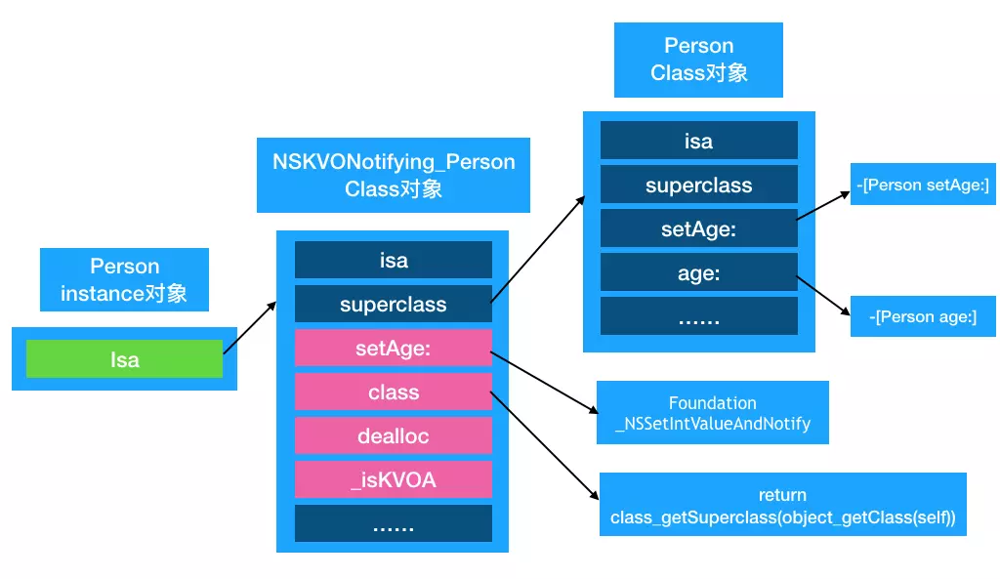

title: iOS底层原理  KVO和KVC本质与联系 --(3)
date: 2019-12-1 11:13:58
tags:
- iOS
categories: iOS
---
我们知道实例实际是存储了成员变量的值和指向类的`isa`指针，`class`对象和`meta-class`对象包含 `isa`、`superclass`和`class_rw_t`这几种结构体，只是数据不一样，`isa`需要`ISA_MASK`&之后才是真正的值。那么今天我们在看一下Key-Value Observing的本质。
 
### KVO本质
 
 首先需要了解KVO基本使用，KVO的全称 Key-Value Observing，俗称“键值监听”，可以用于监听某个对象属性值的改变。下面我们展示一下KVO的基本使用。
 
 ```
 
 #import <Foundation/Foundation.h>

NS_ASSUME_NONNULL_BEGIN

@interface FYPerson : NSObject

@property (nonatomic,assign) NSInteger age;
@end

NS_ASSUME_NONNULL_END

#import "ViewController.h"
#import "FYPerson.h"

@interface ViewController ()
@property (nonatomic,strong)FYPerson *person;
@end

@implementation ViewController

- (void)viewDidLoad {
	[super viewDidLoad];
	// Do any additional setup after loading the view.
	self.person=[FYPerson new];
	self.person.age = 10;
	[self.person addObserver:self
    			  forKeyPath:@"age"
    				 options:NSKeyValueObservingOptionNew
    				 context:nil];
}
- (void)touchesBegan:(NSSet<UITouch *> *)touches withEvent:(UIEvent *)event{
	self.person.age += 1;
}
- (void)observeValueForKeyPath:(NSString *)keyPath ofObject:(id)object change:(NSDictionary<NSKeyValueChangeKey,id> *)change context:(void *)context{
	NSLog(@"监听到了age变化： %@",change);
}
-(void)dealloc{
	[self.person removeObserver:self forKeyPath:@"age"];
}

@end

//下边是输出结果
监听到了age变化： {
    kind = 1;
    new = 12;
    old = 11;
}
 ```
 
 
 从上述代码可以看出，添加监听之后，当值改变时，会触发函数`observeValueForKeyPath:(NSString *)keyPath ofObject:(id)object change:(NSDictionary<NSKeyValueChangeKey,id> *)change context:(void *)context`。
#### 触发条件
 
 ```
 - (void)touchesBegan:(NSSet<UITouch *> *)touches withEvent:(UIEvent *)event{
//	self.person.age += 1;
	[self.person willChangeValueForKey:@"age"];
	[self.person didChangeValueForKey:@"age"];
}
 ```
 
 当把`age`具体值的改变，变成手动调用`willChangeValueForKey`和`didChangeValueForKey`的时候，结果如下：
 
 ```
  监听到了age变化： {
    kind = 1;
    new = 10;
    old = 10;
}
 ```
 
 `new`和`old`的值竟然一样，经测试只有同时先后调用`willChangeValueForKey`和`didChangeValueForKey`，会触发回调函数`observeValueForKeyPath`，由此可知触发条件是`willChangeValueForKey`和`didChangeValueForKey`配合使用。
 
 
 
#### 探寻KVO底层实现原理
通过上述代码我们发现，一旦age属性的值发生改变时，就会通知到监听者，并且我们知道赋值操作都是调用 set方法，我们可以来到Person类中重写age的set方法，观察是否是KVO在set方法内部做了一些操作来通知监听者。
我们发现即使重写了set方法，p1对象和p2对象调用同样的set方法，但是我们发现p1除了调用set方法之外还会另外执行监听器的observeValueForKeyPath方法。
说明KVO在运行时获取对p1对象做了一些改变。相当于在程序运行过程中，对p1对象做了一些变化，使得p1对象在调用setage方法的时候可能做了一些额外的操作，所以问题出在对象身上，两个对象在内存中肯定不一样，两个对象可能本质上并不一样。接下来来探索KVO内部是怎么实现的。
KVO底层实现分析
首先我们对上述代码中添加监听的地方打断点，看观察一下，addObserver方法对p1对象做了什么处理？也就是说p1对象在经过addObserver方法之后发生了什么改变，我们通过打印isa指针：

```
@interface ViewController ()
@property (nonatomic,strong)FYPerson *person;
@property (nonatomic,strong)FYPerson *person2;
@end

@implementation ViewController

- (void)viewDidLoad {
	[super viewDidLoad];
	// Do any additional setup after loading the view.
	self.person=[FYPerson new];
	self.person2 =[FYPerson new];
	self.person.age = 10;
	[self.person addObserver:self
					  forKeyPath:@"age"
						 options:NSKeyValueObservingOptionNew|NSKeyValueObservingOptionOld
						 context:nil];
 Class superclass = NSStringFromClass( class_getSuperclass(NSClassFromString(@"NSKVONotifying_FYPerson")));
Class NSKVONotifying_FYPerson = objc_getClass("NSKVONotifying_FYPerson");
    fy_objc_class* NSKVONotifying_FYPerson_class = (__bridge fy_objc_class *)NSKVONotifying_FYPerson;
						 //此处打断点

//p 命令输出isa指针 
(lldb) p self.person2->isa
(Class) $0 = FYPerson
(lldb) p self.person->isa
(Class) $1 = NSKVONotifying_FYPerson

(lldb) p superclass
(Class) $0 = FYPerson

(lldb) p NSKVONotifying_FYPerson_class->superclass
(Class) $4 = FYPerson
}

```

从输出的isa指针看来，经过`【person addObserver】`之后，`person`的`isa`指针指向了`NSKVONotifying_FYPerson`,而`person2`的`isa`是`FYPerson`，可以看出系统是对`instance`对象的`isa`进行了赋值操作。通过`p NSKVONotifying_FYPerson_class->superclass==FYPerson`可以看出isa是指向了子类，那么子类`NSKVONotifying_FYPerson`到底做了那些事情呢？

看下边代码查看函数isa改变过程：

```
	self.person=[FYPerson new];
	self.person2 =[FYPerson new];
	self.person.age = 10;
//打断点 输出 po [_person methodForSelector:@selector(setAge:)]
	[self.person addObserver:self
					  forKeyPath:@"age"
						 options:NSKeyValueObservingOptionNew|NSKeyValueObservingOptionOld
						 context:nil];
//打断点 输出 po [_person methodForSelector:@selector(setAge:)]

(lldb) po [_person methodForSelector:@selector(setAge:)]
0x000000010666b720

(lldb) po [_person methodForSelector:@selector(setAge:)]
0x00000001069c63d2

//查看IMP指针对应地址和内容
(lldb) p (IMP)0x000000010666b720
(IMP) $2 = 0x000000010666b720 (day03-KVO本质`::-[FYPerson setAge:](int) at FYPerson.h:14)
(lldb) p (IMP)0x00000001069c63d2
(IMP) $3 = 0x00000001069c63d2 (Foundation`_NSSetIntValueAndNotify)
```

可以看出来两次的函数地址不一致，添加KVO之前是`[FYPerson setAge:]`,添加之后是`(Foundation_NSSetIntValueAndNotify)`。我们将`age`的类型改成`double`，再看一下结果：

```
(lldb) po [_person methodForSelector:@selector(setAge:)]
0x00000001080c4710

(lldb) po [_person methodForSelector:@selector(setAge:)]
0x000000010841f18c

(lldb) p (IMP)0x00000001080c4710
(IMP) $2 = 0x00000001080c4710 (day03-KVO本质`::-[FYPerson setAge:](double) at FYPerson.h:14)
(lldb) p (IMP)0x000000010841f18c
(IMP) $3 = 0x000000010841f18c (Foundation`_NSSetDoubleValueAndNotify)
```

`age`是`int`的时候添加之后是`Foundation _NSSetIntValueAndNotify`,改成`double`之后，是`Foundation _NSSetDoubleValueAndNotify`。那么我们可以推测`Foundation`框架中还有很多例如`_NSSetBoolValueAndNotify、_NSSetCharValueAndNotify、_NSSetFloatValueAndNotify、_NSSetLongValueAndNotify`等等函数。
运行`nm Foundation | grep ValueAndNotify`结果如下：

```
nm Foundation  | grep ValueAndNotify
__NSSetBoolValueAndNotify
__NSSetCharValueAndNotify
__NSSetDoubleValueAndNotify
__NSSetFloatValueAndNotify
__NSSetIntValueAndNotify
__NSSetLongLongValueAndNotify
__NSSetLongValueAndNotify
__NSSetObjectValueAndNotify
__NSSetPointValueAndNotify
__NSSetRangeValueAndNotify
__NSSetRectValueAndNotify
__NSSetShortValueAndNotify
__NSSetSizeValueAndNotify
```
#### 另外一种验证方法 
在macOS中可以使用

```
//开始记录日志
instrumentObjcMessageSends(YES);
    // Do stuff...
instrumentObjcMessageSends(NO);//结束记录日志
```

如果将`NSObjCMessageLoggingEnabled`环境变量设置为`YES`，则`Objective-C`运行时会将所有已分派的`Objective-C`消息记录到名为`/tmp/msgSends-<pid>`的文件中。每一次运行会生成一个文件，我们进入到该文件内部：

```
//初始化
+ FYPerson NSObject initialize
+ FYPerson NSObject new
- FYPerson NSObject init
- FYPerson NSObject addObserver:forKeyPath:options:context:
- FYPerson NSObject _isKVOA

****


//子类设置age [NSKVONotifying_FYPerson setAge:]

- NSKVONotifying_FYPerson NSKVONotifying_FYPerson setAge:
- NSKVONotifying_FYPerson NSObject _changeValueForKey:key:key:usingBlock:
- NSKVONotifying_FYPerson NSObject _changeValueForKeys:count:maybeOldValuesDict:maybeNewValuesDict:usingBlock:

- NSKeyValueUnnestedProperty NSKeyValueUnnestedProperty keyPathIfAffectedByValueForKey:exactMatch:
- NSKeyValueUnnestedProperty NSKeyValueUnnestedProperty _keyPathIfAffectedByValueForKey:exactMatch:

//will changeValueForKey
- NSKeyValueUnnestedProperty NSKeyValueUnnestedProperty object:withObservance:willChangeValueForKeyOrKeys:recurse:forwardingValues:
 
//FYPerson 设置age
- FYPerson FYPerson setAge:

// didChangeValueForKeyOrKeys
- NSKeyValueUnnestedProperty NSKeyValueUnnestedProperty object:withObservance:didChangeValueForKeyOrKeys:recurse:forwardingValues:
- NSKeyValueUnnestedProperty NSKeyValueProperty keyPath

//找到key 发送 具体的key对应的value 到observe

- NSKVONotifying_FYPerson NSObject valueForKeyPath:

- NSKVONotifying_FYPerson NSObject valueForKey:
+ NSKVONotifying_FYPerson NSObject _createValueGetterWithContainerClassID:key:
-
+ NSKVONotifying_FYPerson NSObject resolveInstanceMethod:
+ NSKVONotifying_FYPerson NSObject resolveInstanceMethod:
- NSKVONotifying_FYPerson FYPerson age
+ NSKeyValueMethodGetter NSObject alloc
- NSKeyValueMethodGetter NSKeyValueMethodGetter initWithContainerClassID:key:method:
- NSKeyValueGetter NSKeyValueAccessor initWithContainerClassID:key:implementation:selector:extraArguments:count:


- NSKVONotifying_FYPerson NSObject respondsToSelector:
- NSKVONotifying_FYPerson NSKVONotifying_FYPerson class
- NSKVONotifying_FYPerson NSKVONotifying_FYPerson _isKVOA
+ FYPerson NSObject class
+ FYPerson NSObject resolveInstanceMethod:
+ FYPerson NSObject resolveInstanceMethod:

//数据字典
+ NSDictionary NSObject self
+ NSMutableDictionary NSObject self
- NSKeyValueChangeDictionary NSKeyValueChangeDictionary initWithDetailsNoCopy:originalObservable:isPriorNotification:
- NSDictionary NSObject init

// 执行观察者回调函数
- NSKVONotifying_FYPerson FYPerson observeValueForKeyPath:ofObject:change:context:


+ Student NSObject alloc
- Student NSObject init
- Student NSObject dealloc


***//省略一部分代码
 NSKVONotifying_FYPerson NSObject release
- NSKeyValueChangeDictionary NSObject release
- NSKeyValueChangeDictionary NSKeyValueChangeDictionary dealloc
- NSDictionary NSObject dealloc
- NSKeyValueObservationInfo NSObject release
- NSKVONotifying_FYPerson NSObject release
```

经过仔细把重要的函数过滤出来，我们可以了解到`person.age = 12`的执行过程是`NSKVONotifying_FYPerson setAge:`->`NSKeyValueUnnestedProperty object:withObservance:willChangeValueForKeyOrKeys:recurse:forwardingValues`->`FYPerson FYPerson setAge:`->`NSKeyValueUnnestedProperty NSKeyValueUnnestedProperty object:withObservance:didChangeValueForKeyOrKeys:recurse:forwardingValues:
`->`NSKVONotifying_FYPerson NSObject valueForKeyPath:`->`NSMutableDictionary NSObject self`->`- NSKVONotifying_FYPerson FYPerson observeValueForKeyPath:ofObject:change:context:
`，我们来用伪代码实现一遍：

```
//person.age = 12
[NSKVONotifying_FYPerson setAge:12];
willChangeValueForKey@"age";
[FYPerson setAge:12];
didChangeValueForKey@"age";
[[NSMutableDictionary alloc] init];
[NSKVONotifying_FYPerson observeValueForKeyPath:ofObject:change:context];
```

NSKVONotifyin_Person内部结构是怎样的？
首先我们知道，NSKVONotifyin_Person作为Person的子类，其superclass指针指向Person类，并且NSKVONotifyin_Person内部一定对setAge方法做了单独的实现，那么NSKVONotifyin_Person同Person类的差别可能就在于其内存储的对象方法及实现不同。
我们通过runtime分别打印Person类对象和NSKVONotifyin_Person类对象内存储的对象方法

```
- (void)viewDidLoad {
    [super viewDidLoad];

    Person *p1 = [[Person alloc] init];
    p1.age = 1.0;
    Person *p2 = [[Person alloc] init];
    p1.age = 2.0;
    // self 监听 p1的 age属性
    NSKeyValueObservingOptions options = NSKeyValueObservingOptionNew | NSKeyValueObservingOptionOld;
    [p1 addObserver:self forKeyPath:@"age" options:options context:nil];

    [self printMethods: object_getClass(p2)];
    [self printMethods: object_getClass(p1)];

    [p1 removeObserver:self forKeyPath:@"age"];
}

- (void) printMethods:(Class)cls
{
    unsigned int count ;
    Method *methods = class_copyMethodList(cls, &count);
    NSMutableString *methodNames = [NSMutableString string];
    [methodNames appendFormat:@"%@ - ", cls];
    
    for (int i = 0 ; i < count; i++) {
        Method method = methods[i];
        NSString *methodName  = NSStringFromSelector(method_getName(method));
        
        [methodNames appendString: methodName];
        [methodNames appendString:@" "];
        
    }
    
    NSLog(@"%@",methodNames);
    free(methods);
}


//结果如下：
NSKVONotifying_FYPerson - setAge: class dealloc _isKVOA
FYPerson - setAge: age
```

 通过上述代码我们发现NSKVONotifyin_Person中有4个对象方法。分别为setAge: class dealloc _isKVOA，那么至此我们可以画出NSKVONotifyin_Person的内存结构以及方法调用顺序。
 


这里NSKVONotifyin_Person重写class方法是为了隐藏NSKVONotifyin_Person。不被外界所看到。我们在p1添加过KVO监听之后，分别打印p1和p2对象的class可以发现他们都返回Person。

如果NSKVONotifyin_Person不重写class方法，那么当对象要调用class对象方法的时候就会一直向上找来到nsobject，而nsobect的class的实现大致为返回自己isa指向的类，返回p1的isa指向的类那么打印出来的类就是NSKVONotifyin_Person，但是apple不希望将NSKVONotifyin_Person类暴露出来，并且不希望我们知道NSKVONotifyin_Person内部实现，所以在内部重写了class类，直接返回Person类，所以外界在调用p1的class对象方法时，是Person类。这样p1给外界的感觉p1还是Person类，并不知道NSKVONotifyin_Person子类的存在。

那么我们可以猜测NSKVONotifyin_Person内重写的class内部实现大致为

```
- (Class) class {
     // 得到类对象，在找到类对象父类
     return class_getSuperclass(object_getClass(self));
}
```

最后自己写代码验证一下：

```

@implementation FYPerson
-(void)willChangeValueForKey:(NSString *)key{
	NSLog(@"%s 开始",__func__);
	[super didChangeValueForKey:key];
	NSLog(@"%s 结束",__func__);
}
- (void)didChangeValueForKey:(NSString *)key{
	NSLog(@"%s 开始",__func__);
	[super didChangeValueForKey:key];
	NSLog(@"%s 结束",__func__);
}
- (void)setAge:(double)age{
	_age = age;
	NSLog(@"%s",__func__);
}

@end

```

执行之后结果如下：

```
-[FYPerson willChangeValueForKey:] 开始
-[FYPerson willChangeValueForKey:] 结束
-[FYPerson setAge:]
-[FYPerson didChangeValueForKey:] 开始
 监听到了age变化： {
    kind = 1;
    new = 11;
    old = 10;
}
-[FYPerson didChangeValueForKey:] 结束
```

#### 总结：
KVO其实是一个通过runtime注册建立子类，通过修改instance的isa指针，指向新的子类，重写instace的class方法来掩盖，子类拥有自己的set方法，调用顺序是willChangeValueForKey方法、原来的setter方法实现、didChangeValueForKey方法，而didChangeValueForKey方法内部又会调用监听器的observeValueForKeyPath:ofObject:change:context:监听方法。

### KVC的本质

KVC的全称是Key-Value Coding，俗称“键值编码”，可以通过一个key来访问某个属性。
常用的API有

```
- (void)setValue:(id)value forKeyPath:(NSString *)keyPath;
- (void)setValue:(id)value forKey:(NSString *)key;
- (id)valueForKeyPath:(NSString *)keyPath;
- (id)valueForKey:(NSString *)key; 
```

其实当Obj调用`(void)setValue:(id)value forKey:(NSString *)key`的时候，`obj`会主动寻找方法`setKey`和`_setKey`两个方法，没有找到这两个方法会再去寻找`accessInstanceVariablesDirectly`，返回值为`NO`则抛出异常，返回`YES`则去按照`_key`、`_isKey`、`key`、`isKey`的查找优先级查找成员变量，找到之后直接复制，否则抛出异常。
我们使用这段代码来验证：

```
@interface FYPerson(){
}
@end
@implementation FYPerson
//code1
- (void)setAge:(NSInteger)age{
	NSLog(@"%s %ld",__func__,(long)age);
}
//code2
- (void)_setAge:(NSInteger)age{
	NSLog(@"%s %ld",__func__,(long)age);
}
@end


FYPerson *p=[[FYPerson alloc]init];
[p setValue:@(2) forKey:@"age"];

```

当执行`code1`和`code2`都有的时候，输出`-[FYPerson setAge:] 2`，当`code1`注释掉，输出`-[FYPerson _setAge:] 2`，可以看出执行顺序是`setAge`，没有`setAge`的时候再去执行`_setAge`。

现在新增`FYPerson`4个成员变量，依次注释掉他们来测试寻找成员变量的顺序。
```

@interface FYPerson : NSObject
{
@public
	NSInteger _age;
	NSInteger _isAge;
	NSInteger age;
	NSInteger isAge;
}
@end


FYPerson *p=[[FYPerson alloc]init];
[p setValue:@(2) forKey:@"age"];

NSLog(@"age:%d _age:%d isAge:%d _isAge:%d",(int)p->age,(int)p->_age,(int)p->isAge,(int)p->_isAge);

```

- 没注释输出 `age:0 _age:2 isAge:0 _isAge:0`
- 注释`_age`输出 `age:0 isAge:0 _isAge:2`
- 注释`_isAge`输出 `age:2 isAge:0`
- 注释`age`输出 `isAge:2`

#### KVC和KVO联系
我们知道KVC本质也是调用setter方法，那么会出发KVO吗？

```
FYPerson *p=[[FYPerson alloc]init];
[p addObserver:p
	forKeyPath:@"age"
	   options:NSKeyValueChangeNewKey
	   context:nil];
[p setValue:@2 forKey:@"age"];
[p removeObserver:p forKeyPath:@"age"];

@interface FYPerson(){
	@public
	NSInteger _age;
	NSInteger _isAge;
	NSInteger age;
	NSInteger isAge;
}
@end
@implementation FYPerson
- (void)observeValueForKeyPath:(NSString *)keyPath ofObject:(id)object change:(NSDictionary<NSKeyValueChangeKey,id> *)change context:(void *)context{
	NSLog(@"%@",change);
}
@end

//结果
{
    kind = 1;
    new = 2;
    old = 0;
}
```

经过测试，可以看出KVC能触发KVO的。那么`valueForKey:key`底层是怎么运行的呢？其实底层是按照顺序查找四个方法`_age`->`_isAge`->`age`->`isAge`。我们测试一下：

```
FYPerson *p=[[FYPerson alloc]init];
p->_age = 1;
p->_isAge = 2;
p->age = 3;
p->isAge = 4;
NSLog(@"value:%@",[p valueForKey:@"age"]);
//依次注释1,2,3，依次输出是1->2->3->4
```

#### 总结：
KVC其实本质是执行4个set方法和4个get方法，当使用`setValue:forKey:key`会触发KVO，找不到4个方法的时候会抛出异常。

#### 资料下载
- [学习资料下载](https://github.com/ifgyong/iOSDataFactory)
- [demo code](https://github.com/ifgyong/demo/tree/master/OC)


之前看的没有手动去试验一下，然后再写出来，现在总结一下，参考了很多文章，还有macOS中日志记录是无意搜索出来了一个老外的blog，大家可以了解下，以后会有用，后边会讲如何`hook objc_msgsend`,感觉这个挺好玩的。

本文章之所以图片比较少，我觉得还是跟着代码敲一遍，印象比较深刻。

 ---
最怕一生碌碌无为，还安慰自己平凡可贵。
 
 广告时间


 
 
